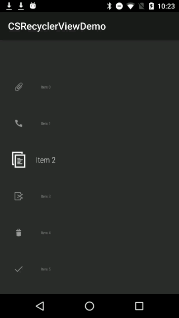

A RecyclerView demo that central item can be scaled.

modified from [WearableListView](https://android.googlesource.com/platform/packages/apps/PackageInstaller/+/master/src/android/support/wearable/view/WearableListView.java), i want to change WearableListView to show more than three items.

just use the method to set the visable item number: `setMaxVisableItemNum(int maxItemNum)`

###Note:###

  the maxItemNum should be an odd number.

